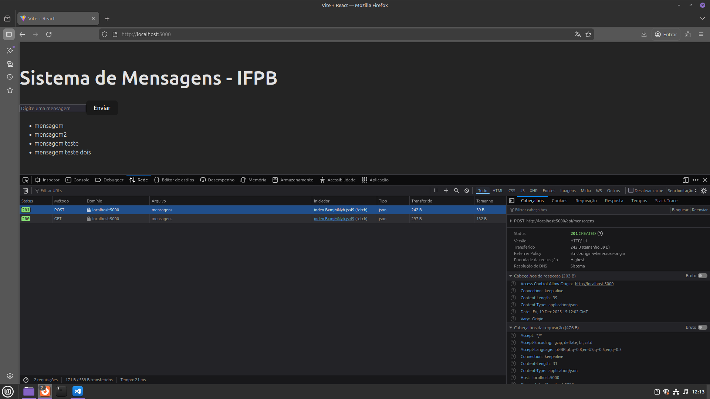

# Projeto 01 - Deploy de Aplicação Fullstack em Kubernetes

Este projeto consiste no deploy de uma aplicação web (React + Flask + PostgreSQL) em um cluster Kubernetes (Kind), demonstrando conhecimentos em orquestração, persistência de dados, segregação de recursos e gerenciamento de tráfego.

## Integrantes

* José Rodrigo S. Padilha - 20231380017
* 

## Requisitos
* Docker e Docker Compose
* Kind (Kubernetes in Docker)
* Kubectl

## Instruções

### 1. Criar o Cluster
Utilizamos uma configuração personalizada para mapeamento de portas.
```bash
kind create cluster --name projeto-fofos --config kind-config.yaml
```

### 2. Instalar o Ingress Controller NGINX

```bash
kubectl apply -f https://raw.githubusercontent.com/kubernetes/ingress-nginx/main/deploy/static/provider/kind/deploy.yaml
```

Aguarde até que o pod do ingress-nginx esteja com status Running (pode demorar alguns minutos): `kubectl wait --namespace ingress-nginx --for=condition=ready pod --selector=app.kubernetes.io/component=controller --timeout=90s`

### 3. Criar Namespaces e Secrets

```bash
# Criação dos ambientes
kubectl apply -f namespace.yaml

# Aplica as credenciais no namespace do Banco
kubectl apply -f database/secret.yaml

# Replica a secret para o namespace da aplicação (backend precisa ler a senha)
kubectl create secret generic db-secret --from-literal=POSTGRES_USER=postgres --from-literal=POSTGRES_PASSWORD=postgres -n app
```

### 4. Deploy do Banco de Dados

```bash
kubectl apply -f database/pvc.yaml
kubectl apply -f database/statefulset.yaml
```

### 5. Deploy da Aplicação (Backend e Frontend)

```bash
kubectl apply -f backend/configmap.yaml
kubectl apply -f backend/deployment.yaml
kubectl apply -f frontend/deployment.yaml
```

### 6. Configurar o Tráfego (Ingress)

```bash
kubectl apply -f ingress/ingress.yaml
```

### 7. Verificar Namespaces:

```bash
kubectl get all -n app
kubectl get all -n database
```

### 8. Testando:

```bash
# Enviando mensagens usando curl
curl 'http://localhost:5000/api/mensagens' -X POST --data-raw '{"texto":"mensagem teste"}' -H 'content-type: application/json'

# Lendo a mensagem
curl 'http://localhost:5000/api/mensagens' -X GET
```

## Imagem final

